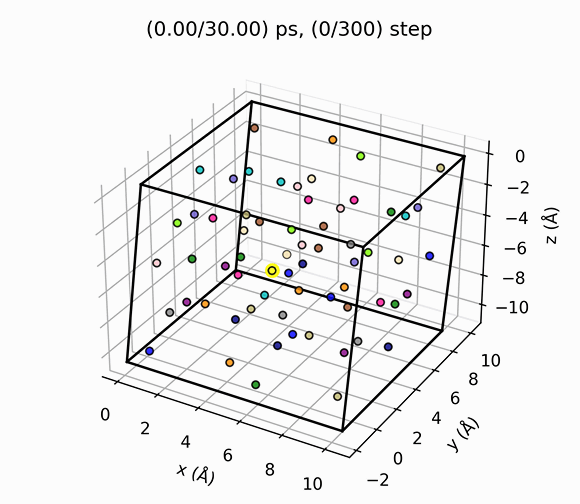

# VacHopPy
---
**VacHopPy** is a <ins>**Py**</ins>thon package to anlyze oxygen <ins>**Vac**</ins>ancy <ins>**Hop**</ins>ping in crystalline materials.

    

### Features
* tracing vacancy in *ab inito* molecular dynamics. (AIMD)
* comparison between MD trajectory and NEB method.
* obtain **atomic vibration freuqeuncy**.
* obtrain mass transport parameters using **Einstein relation**.
