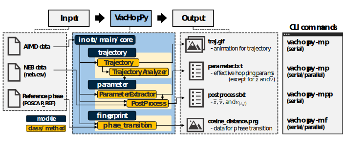
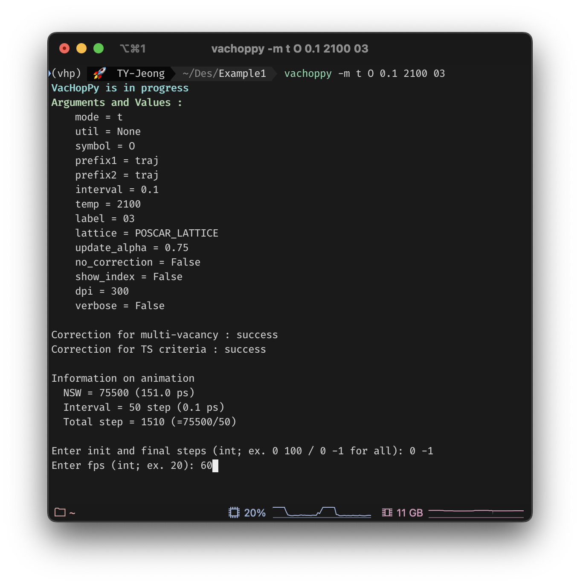

# VacHopPy 

---
**VacHopPy** is a Python package for analyzing vacancy hopping mechanisms based on *Ab initio* molecular dynamics (AIMD) simulations. A detailed explanation on **VacHopPy** framwork is available in **here**.


<div align=center>
<p>
    
</p>
</div>


## Features

* Tracking of **vacancy trajectories** in AIMD simulations
* Extraction of **effective hopping parameter** set
* Assessment of lattice stability or **phase transitions**

<br>

**Effective hopping parameter** set, a key improvement of **VacHopPy**, is a single, representative set of hopping parameters, which is determined by integrating all possible hopping paths in a given system considering energetic and geometric properties. It includes the following parameters (the bar expression ($`\bar{x}`$) is used to emphasize the parameters are effective values):

<div align="center">

|<center>Symbol</center>|<center>Description</center>|
|:---:|---|
| $`\bar{a}`$ |Hopping distance (Å)|
| $`\bar{E}_{a}`$ |Hopping barrier (eV)|
| $`\bar{z}`$ |Coordination number|
| $`\bar{ν}`$ |Jump attempt frequency (THz)|
| $`f`$ |Correlation factor|

</div>


Effective hopping parameter set is beneficial for **multiscale modeling**, which bridges the *ab intio* calculations and larger-scale simulations, such as TCAD, continuum models, and KMC methods, since required mass transport quantities are expressed in a simple Arrhenius equation. For example, diffusion coefficient ($D$) is given by:

```math
D = \frac{1}{6}\bar{z}\bar{a}^{2}\bar{ν}f \cdot \exp(-\frac{\bar{E}_{a}}{k_{B}T})
```

<br>

where $k_B$ represents the Boltzmann constant. Note that the exact expression of $D$ consist multiple exponential terms, each corresponds to a distinct vacancy hopping path.


## Contents

* Installation
* List of commands
* How to implement
  * Vacancy trajectory determination
    * Making animation
    * Distribution of hopping path
  * Effective hopping parameter calculation
    * Diffusion coefficient 
    * Atomic vibration coefficient
  * Assessment of lattice stability
  


## Installation

This package can be easily installed via pip. The current version of  **VacHopPy** was developed based on VASP 5.4.4.

```ruby
pip intall vachoppy
```

## Available commands

**VacHopPy** provides a command-line interface (CLI). Belows are available CLI commands:

<div align=center>
<table>
    <tr>
        <th scope="col">Option 1</td>
        <th scope="col">Option 2</td>
        <th scope="col">Use</td>
    </tr>
    <tr>
        <td rowspan="4">-m<br>(main)</td>
        <td>t</td>
        <td>Make an animation for vacancy trajectories</td>
    </tr>
    <tr>
        <!-- <td>2</td> -->
        <td>p</td>
        <td>Calculate effective hopping parameters (excluding &#772;z and &#772;ν)</td>
    </tr>
    <tr>
        <!-- <td>4</td> -->
        <td>pp</td>
        <td>Calculate &#772;z and &#772;ν (post-processing for -m p option)</td>
    </tr>
    <tr>
        <!-- <td>5</td> -->
        <td>f</td>
        <td>Perform fingerprint analyses</td>
    <tr>
        <td rowspan="6">-u<br>(utility)</td>
        <td>extract_force</td>
        <td>Extract FORCE file from vasprun.xml</td>
    </tr>
    <tr>
        <!-- <td>2</td> -->
        <td>concat_xdatcar</td>
        <td>Concatenate two XDATCAR files</td>
    </tr>
    <tr>
        <!-- <td>3</td> -->
        <td>concat_force</td>
        <td>Concatenate two FORCE files</td>
    </tr>
    <tr>
        <!-- <td>4</td> -->
        <td>update_outcar</td>
        <td>Combine two OUTCAR files</td>
    </tr>
    <tr>
        <!-- <td>5</td> -->
        <td>fingerprint</td>
        <td>Extract fingerprint</td>
    </tr>
    <tr>
        <!-- <td>6</td> -->
        <td>cosine_distance</td>
        <td>Calculate cosine distance</td>
    </tr>
</table>
</div>

For detailed descriptions, please use `-h` options:

```ruby
vachoppy -h # list of available commands
vachoppy -m p -h # explanation for '-m p' option
```

For time-consuming commaands, `vachoppy -m p` and `vachoppy -m f`, parallelization is supported by **mpirun**. For parallelization, please specify `--parallel` option:

```ruby
vachoppy -m p O 0.1 # serial computation
mpirun -np 10 vachoppy -m p O 0.1 --parallel # parallel computation with 10 cpu nodes.
```


Belows is summary of the main commands (only main modules are shown for clarity):
<div align=center>
<p>
    
</p>
</div>


## How to implement

Example files can be downloaded from:

* **Example1** : Vacancy hopping in rutile TiO<SUB>2</SUB> [download (29 GB)](https://drive.google.com/file/d/1SudMlQk40cJnVgrkklK6b4nhiF3YWPOY/view?usp=sharing)
* **Example2** : Phase transition of monoclinic HfO<SUB>2</SUB> at 2200 K  [download (37 MB)](https://drive.google.com/file/d/1SuxEHmGdVNkk-mogdWWDOOUPZqX74QG5/view?usp=sharing)

## 0. Preparation
### Input data
To run **VacHopPy**, the user needs four types of input data: **XDATCAR**, **OUTCAR**, **FORCE**, and **POSCAR_LATTICE**. In current version, **VacHopPy** supports only single-vacancy simulation, with multi-vacancy support planned for a future update.

#### (1) XDATCAR and OUTCAR 
XDATCAR and OUTCAR are standard VASP output files containing atomic trajectory from AIMD simulation and simulation conditions, respectively. The input atomic structure (*i.e.*, POSCAR) must include a **single vacancy**, and the AIMD simulation should be performed under the **NVT ensemble** (set **NBLOCK = 1**).

#### (2) FORCE (*optinal*)
FORCE file contains force vectors acting on atoms and can be extracted from the **vasprun.xml** file (a standard VASP output) using the following command:
```ruby
vachoppy -u extract_force -in vasprun.xml -out FORCE
```
The FORCE file helps assign atoms to corresponding lattice points based on their relatice positions to transition states. If the FORCE file is not provided, atomic occupancies will be determined solely based on proximity. Once atoms are assigned, the vacancy position is identified as an unoccupied lattice point.

#### (3) POSCAR_LATTICE
POSCAR_LATTICE contains the perfect crystal structure without a vacancy. Its lattice parameters must match those of input structure (POSCAR) of the AIMD simulations. This file is used to define the lattice points for vacancy identification.

#### (4) File organization
Since AIMD simulations commonly cover timescales shorter than nanoseconds, a single AIMD simulation may contain a few hopping events. However, since **VacHopPy** computes the effective hopping parameters in static manner, sufficient sampling of hopping events is necessary to ensure reliablilty. To address this, **VacHopPy** processes multiple AIMD datasets simultaneously. Each AIMD dataset is distinguished by a number appended after an underscore in the XDATCAR and FORCE file names (e.g., XDATCAR_01, FORCE_01). Below is an example of the recommended file structure:

```ruby
Example1
 ┣ traj
 ┃ ┣ traj.1900K # AIMD simulations conducted at 1900 K
 ┃ ┃ ┣ XDATCAR_01, FORCE_01 # Simiulations in the same directory should be 
 ┃ ┃ ┣ XDATCAR_02, FORCE_02 # conducted under the same conditions
 ┃ ┃ ┣ XDATCAR_03, FORCE_03
 ┃ ┃ ┗ OUTCAR
 ┃ ┣ traj.2000K
 ┃ ┃ ┣ XDATCAR_01, FORCE_01
 ┃ ┃ ┣ XDATCAR_02, FORCE_02
 ┃ ┃ ┣ XDATCAR_03, FORCE_03
 ┃ ┃ ┗ OUTCAR
 ┃ ┗ traj.2100K
 ┃ ┃ ┣ XDATCAR_01, FORCE_01
 ┃ ┃ ┣ XDATCAR_02, FORCE_02
 ┃ ┃ ┣ XDATCAR_03, FORCE_03
 ┃ ┃ ┗ OUTCAR
 ┗ POSCAR_LATTICE # POSCAR of the perfect crystal
```

Simulations at the same temperature should be conducted under identical conditions. In other words, **NSW** and **POTIM** tags in INCAR should be the same. Therefore, only one OUTCAR file is needed per temperature directory.


### t<SUB> interval</SUB>


**VacHopPy** reads AIMD simulation data in VASP format (XDATCAR, OUTCAR, and FORCE). **XDATCAR** and **OUTCAR** are the typical VASP output files, containing information on atomic positions and simulation conditions, respectively. **FORCE** (optinal) includes force vectors and can be extracted from **vasprun.xml** file using `vachoppy -u extract_force` command:
```ruby
vachoppy -u extract_force -in vasprun.xml -out FORCE
```
If FORCE files are included in the input dataset, the atomic occupanciesa are determined based on transition state (TS) distribution; otherwise, the trajectory is determined based simply on proximity.

> In current version, **VacHopPy** supports only AIMD simulations conducted using the **NVT ensmeble**. Each ensemble cell should contains a single vacancy. (Support for multi vacancies will be added in a future update) 

Since AIMD simulations are commonly conducted on time scales shorter than nanoseconds, a single AIMD simulation includes a limited number of hopping events. To overcome this limitation, **VacHopPy** can simultaneously process multiple bundles of AIMD simulation results, each belonging to the same NVT ensemble group. Each bundle is distinguished by a number appended after an underscore in the XDATCAR and FORCE file names (e.g., XDATCAR_01, FORCE_01). Below is an example of file tree:


```ruby
Example1
 ┣ traj
 ┃ ┣ traj.1900K # AIMD simulations conducted at 1900 K
 ┃ ┃ ┣ XDATCAR_01, FORCE_01 # Simiulations should be 
 ┃ ┃ ┣ XDATCAR_02, FORCE_02 # conducted in the same condition
 ┃ ┃ ┣ XDATCAR_03, FORCE_03
 ┃ ┃ ┗ OUTCAR
 ┃ ┣ traj.2000K
 ┃ ┃ ┣ XDATCAR_01, FORCE_01
 ┃ ┃ ┣ XDATCAR_02, FORCE_02
 ┃ ┃ ┣ XDATCAR_03, FORCE_03
 ┃ ┃ ┗ OUTCAR
 ┃ ┗ traj.2100K
 ┃ ┃ ┣ XDATCAR_01, FORCE_01
 ┃ ┃ ┣ XDATCAR_02, FORCE_02
 ┃ ┃ ┣ XDATCAR_03, FORCE_03
 ┃ ┃ ┗ OUTCAR
 ┗ POSCAR_LATTICE # POSCAR of perfect cell
```

The simulations in the same temperature should be conducted with the same conditions. Hence, only one OUTCAR file exist in each subdirectory.

## 1. Vacancy trajectory determination

Please download and unzup **Example1** file attatched above.

Open **Example1** directory, and run:
```ruby
 vachoppy -m t O 0.1 2100 03 # vacancy type, t_interval, temperature, label
 ```


<br>
<br>
<br>
<br>
<br>
<br>
<br>
<br>
<br>


A Key improvement in **VacHopPy** is introduction of an **effective hopping parameter** set. The hopping parameters inherently depend on the selection of hopping paths, resulting in multiple sets of hopping parameters within a given lattice. However, in order to use the *ab initio* transport parameters in larger-scale simulations (e.g., TCAD, continuum models, KMC methods), a well-defined, single effective hopping parameter set is required. This is because macroscopic equations typically do not account for multiple hopping paths. To sum up, the **effective hopping parameter** set is a single, consolidated parameter set that represents all hopping paths within a given lattice, making it suitable for multiscale modeling.


<div align=center>
<p>
    
</p>
</div>


## Features

* Simultaneous calculation of **effective hopping parameters**
* Tracking of **vacancy trajectories** in AIMD simulations
* Assessment of lattice stability or **phase transitions**

 Belows are a **list of effective hopping parameters** which can be obtained from **VacHopPy**:

<div align="center">

|<center>Symbol</center>|<center>Description</center>|
|:---:|---|
| $`\bar{E}_{a}`$ |Hopping barrier (eV)|
| $`\bar{a}`$ |Hopping distance (Å)|
| $`\bar{z}`$ |Coordination number|
| $`\bar{ν}`$ |Jump attempt frequency (THz)|
| $`f`$ |Correlation factor|

</div>

The bar expression (e.g., $`\bar{x}`$) is used to emphasize the parameters are effective values. In this framework, the effective correlation factor ($`\bar{f}`$) is assumed to be identical to the original $f$; therefore,the correlation factor is uniformly denoted as $`f`$. 

Effective diffusion quantities, including effective diffusion coefficient ($`\bar{D}`$) and effective residence time ($`\bar{τ}`$), can be derived by combining the effective hopping parameters, as follows:

```math
\bar{D} = \frac{1}{6}\bar{z}\bar{a}^{2}\bar{ν} \cdot \exp(-\frac{\bar{E}_{a}}{k_{B}T}) \times f(T)
```
```math
\bar{τ} = \frac{1}{\bar{z}\cdot\bar{ν}} \cdot \exp(\frac{\bar{E}_{a}}{k_{B}T})
```
<br>
Here, all parameters correspond to the effective value, hence, the diffusion quantities can be expressed as simple Arrhenims forms. The exact expressions for $`D`$ and $`τ`$ consist multiple exponential terms, each corresponds to a distinct vacancy hopping path. These complex expressions are unfavorable for continuum equations.

## Contents

* Installation
* List of commands
* How to implement
  * Vacancy trajectory determination
    * Making animation
    * Distribution of hopping path
  * Effective hopping parameter calculation
    * Diffusion coefficient 
    * Atomic vibration coefficient
  * Assessment of lattice stability
  

## Installation

This package can be easily installed via pip. The current version of  **VacHopPy** was developed based on VASP 5.4.4.

```ruby
pip intall vachoppy
```

## Available commands

**VacHopPy** provides a command-line interface (CLI). Belows are available CLI commands:

<div align=center>
<table>
    <tr>
        <th scope="col">Option 1</td>
        <th scope="col">Option 2</td>
        <th scope="col">Use</td>
    </tr>
    <tr>
        <td rowspan="4">-m<br>(main)</td>
        <td>p</td>
        <td>Calculate effective hopping parameters (excluding &#772;z and &#772;ν)</td>
    </tr>
    <tr>
        <!-- <td>2</td> -->
        <td>pp</td>
        <td>Calculate &#772;z and &#772;ν (post-processing for `-m p` option)</td>
    </tr>
    <tr>
        <!-- <td>4</td> -->
        <td>t</td>
        <td>Make an animation for vacancy trajectories</td>
    </tr>
    <tr>
        <!-- <td>5</td> -->
        <td>f</td>
        <td>Perform fingerprint analyses</td>
    <tr>
        <td rowspan="6">-u<br>(utility)</td>
        <td>extract_force</td>
        <td>Extract FORCE file from vasprun.xml</td>
    </tr>
    <tr>
        <!-- <td>2</td> -->
        <td>concat_xdatcar</td>
        <td>Concatenate two XDATCAR files</td>
    </tr>
    <tr>
        <!-- <td>3</td> -->
        <td>concat_force</td>
        <td>Concatenate two FORCE files</td>
    </tr>
    <tr>
        <!-- <td>4</td> -->
        <td>update_outcar</td>
        <td>Combine two OUTCAR files</td>
    </tr>
    <tr>
        <!-- <td>5</td> -->
        <td>fingerprint</td>
        <td>Extract fingerprint</td>
    </tr>
    <tr>
        <!-- <td>6</td> -->
        <td>cosine_distance</td>
        <td>Calculate cosine distance</td>
    </tr>
</table>
</div>

For detailed descriptions, please use `-h` options:
```ruby
vachoppy -h # list of available commands
vachoppy -m p -h # explanation for '-m p' option
```

Belows is summary of the main commands:
<div align=center>
<p>
    
</p>
</div>
For clarity, only the main modules and classes are shown in the VacHopPy architecture.


## How to implement

Example files can be downloaded from:

* **Example1** : Vacancy hopping in rutile TiO<SUB>2</SUB> [download (28 GB)](https://drive.google.com/file/d/1SudMlQk40cJnVgrkklK6b4nhiF3YWPOY/view?usp=sharing)
* **Example2** : Phase transition of monoclinic HfO<SUB>2</SUB> at 2200 K  [download (37 MB)](https://drive.google.com/file/d/1SuxEHmGdVNkk-mogdWWDOOUPZqX74QG5/view?usp=sharing)

## 0. Preparation
**VacHopPy** reads AIMD simulation data in VASP format (XDATCAR, OUTCAR, and FORCE). **XDATCAR** and **OUTCAR** are the typical VASP output files, contain information on atomic positions and simulation conditions, respectively. **FORCE** (optinal) includes force vectors and can be extracted from **vasprun.xml** file using `vachoppy -u extract_force` command. If FORCE files are included in the input dataset, the atomic occupanciesa are determined based on transition state (TS) distribution; otherwise, the trajectory is determined based simply on proximity.

> In current version, **VacHopPy** supports only AIMD simulations conducted using the **NVT ensmeble**. Each ensemble cell should contains a single vacancy. (Support for multi vacancies will be added in a future update) 

Since AIMD simulations are commonly conducted on time scales shorter than nanoseconds, a single AIMD simulation includes a limited number of hopping events. To overcome this limitation, **VacHopPy** can simultaneously process multiple bundles of AIMD simulation results, each belonging to the same NVT ensemble group. Each bundle is distinguished by a number appended after an underscore in the XDATCAR and FORCE file names (e.g., XDATCAR_01, FORCE_01). Below is an example of file tree:


```ruby
Example1
 ┣ traj
 ┃ ┣ traj.1900K # AIMD simulations conducted at 1900 K
 ┃ ┃ ┣ XDATCAR_01, FORCE_01 # Simiulations should be 
 ┃ ┃ ┣ XDATCAR_02, FORCE_02 # conducted in the same condition
 ┃ ┃ ┣ XDATCAR_03, FORCE_03
 ┃ ┃ ┗ OUTCAR
 ┃ ┣ traj.2000K
 ┃ ┃ ┣ XDATCAR_01, FORCE_01
 ┃ ┃ ┣ XDATCAR_02, FORCE_02
 ┃ ┃ ┣ XDATCAR_03, FORCE_03
 ┃ ┃ ┗ OUTCAR
 ┃ ┗ traj.2100K
 ┃ ┃ ┣ XDATCAR_01, FORCE_01
 ┃ ┃ ┣ XDATCAR_02, FORCE_02
 ┃ ┃ ┣ XDATCAR_03, FORCE_03
 ┃ ┃ ┗ OUTCAR
 ┗ POSCAR_LATTICE # POSCAR of perfect cell
```

The simulations in the same temperature should be conducted with the same conditions. Hence, only one OUTCAR file exist in each subdirectory.

## 1. Vacancy trajectory determination

Please download and unzup **Example1** file attatched above.

Open **Example1** directory, and run:
```ruby
 vachoppy -m t O 0.1 2100 03 # vacancy type, t_interval, temperature, label
 ```


**Process:**


The user can set the time range and fps of the trajectory animation through two messages in the prompt window:


<div align=center>
<p>
    
</p>
</div>

**Output:**

The result is saved in **traj.gif**, while the snapshots are located in **snapshot** directory. Below is an example of **traj.gif**:

<div align=center>
<p>
    
</p>
</div>

In this animation, the solid box and the color-coded circlesa represent the lattice (here, rutile TiO<SUB>2</SUB> lattice) and the lattice points (here, oxygen sites) corresponding to the atom designated in the CLI command (O), respectively. The yellow-colored circle corresponds to the vacancy position (*i.e.*, unoccupied lattice point), while other colors represent occupied lattice points. An atomic movements is represented with an arrow, whose color is the same as the moving atom. User can adjust the resolutions of the snapshote and animation using **--dpi** option (default: 300).

## 2. Effective hopping parameter calculation
Use:
```ruby
vachoppy -m p O 0.1 # symbol, t_interval
```
This command will provides effective hopping parameters of an oxygen vacancy.


## 3. Assessment of lattice stability
