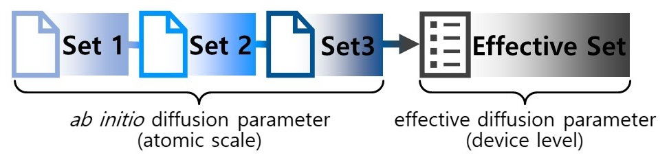
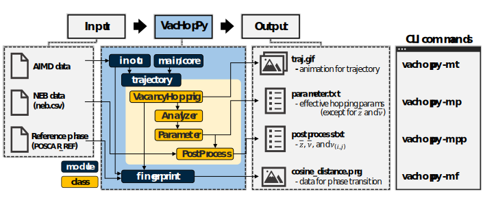

# VacHopPy 

---
**VacHopPy** is a Python package to analyze trajectory of vacancy hopping mechanisms, based on *Ab initio* molecular dynamics (AIMD) simulations.


<div align=center>
<p>
    
</p>
</div>


A Key improvement in **VacHopPy** is introduction of an **effective hopping parameter** set. The hopping parameters inherently depend on the selction of hopping paths, resulting in multiple sets of hopping parameters within a given lattice. However, for macroscopic simulations (e.g., TCAD, continuum models, KMC methods), a well-defined, single effective hopping parameter set is required. This is because macroscopic equations typically do not account for multiple hopping paths. To sum up, the **effective hopping parameter** set is a single, consolidated parameter set that represents all hopping paths within a given lattice, making it suitable for multiscale modeling.


<div align=center>
<p>
    
</p>
</div>

For detailed explanation about **VacHopPy** framework, see **this paper**.


## Features

* Simultaneous calculation of **effective hopping parameters**
* Tracking of **vacancy trajectories** in AIMD simulations
* Assessment of lattice stability or **phase transitions**

 Belows are a **list of effective hopping parameters** which can be obtained from **VacHopPy**:

<div align="center">

|<center>Symbol</center>|<center>Description</center>|
|:---:|---|
|$`\bar{E}_{a}`$|Hopping barrier (eV)|
|$`\bar{a}`$|Hopping distance (Å)|
|$`\bar{z}`$|Coordination number|
|$`\bar{ν}`$|Jump attempt frequency (THz)|
|$`f`$|Correlation factor|

</div>

The bar expression ($`\bar{x}`$) is used to emphasize the parameters are effective values. In this framework, the effective correlation factor ($`\bar{f}`$) is assumed to be identical to the original $f$; therefore,the correlation factor is uniformly denoted as $`f`$. 

Diffusion quantities, including diffusion coefficient ($`D`$) and residence time ($`τ`$), can be derived by combining the effective hopping parameters, as follows:

```math
\bar{D} = \frac{1}{6}\bar{z}\bar{a}^{2}\bar{ν} \cdot \exp(-\frac{\bar{E}_{a}}{k_{B}T}) \times f(T)
```
```math
\bar{τ} = \frac{1}{\bar{z}\cdot\bar{ν}} \cdot \exp(\frac{\bar{E}_{a}}{k_{B}T})
```

Here, all parameters correspond to the effective value, hence, the diffusion quantities can be expressed as simple Arrhenims forms. The exact expressions for D and τ consist multiple exponential terms, each corresponds to a distinct vacancy hopping path. These complex expressions are unfavorable for continuum equations.

## Contents

* Installation
* List of commands
* How to implement
  * Vacancy trajectory determination
    * Making animation
    * Distribution of hopping path
  * Effective hopping parameter calculation
    * Diffusion coefficient 
    * Atomic vibration coefficient
  * Assessment of lattice stability
  

## Installation

This package can be easily installed via pip. The current version of  **VacHopPy** was developed based on VASP 5.4.4.

```ruby
pip intall vachoppy
```


## Available commands

**VacHopPy** provides a command-line interface (CLI). Belows are available CLI commands:

<div align=center>
<table>
    <tr>
        <th scope="col">Option 1</td>
        <th scope="col">Option 2</td>
        <th scope="col">Use</td>
    </tr>
    <tr>
        <td rowspan="4">-m<br>(main)</td>
        <td>p</td>
        <td>Calculate effective hopping parameters (excluding &#772;z and &#772;ν)</td>
    </tr>
    <tr>
        <!-- <td>2</td> -->
        <td>pp</td>
        <td>Calculate &#772;z and &#772;ν (post-processing for `-m p` option)</td>
    </tr>
    <tr>
        <!-- <td>4</td> -->
        <td>t</td>
        <td>Make an animation for vacancy trajectories</td>
    </tr>
    <tr>
        <!-- <td>5</td> -->
        <td>f</td>
        <td>Perform fingerprint analyses</td>
    <tr>
        <td rowspan="6">-u<br>(utility)</td>
        <td>extract_force</td>
        <td>Extract FORCE file from vasprun.xml</td>
    </tr>
    <tr>
        <!-- <td>2</td> -->
        <td>concat_xdatcar</td>
        <td>Concatenate two XDATCAR files</td>
    </tr>
    <tr>
        <!-- <td>3</td> -->
        <td>concat_force</td>
        <td>Concatenate two FORCE files</td>
    </tr>
    <tr>
        <!-- <td>4</td> -->
        <td>update_outcar</td>
        <td>Combine two OUTCAR files</td>
    </tr>
    <tr>
        <!-- <td>5</td> -->
        <td>fingerprint</td>
        <td>Extract fingerprint</td>
    </tr>
    <tr>
        <!-- <td>6</td> -->
        <td>cosine_distance</td>
        <td>Calculate cosine distance</td>
    </tr>
</table>
</div>

For detailed descriptions, please use `-h` options:
```ruby
vachoppy -h # list of available commands
vachoppy -m p -h # explanation for '-m p' option
```

Belows is summary of the main commands:
<div align=center>
<p>
    
</p>
</div>
For clarity, only the main modules and classes are shown in the VacHopPy architecture.


## How to implement

Example files can be downloaded from:

* **Example 1** : Vacancy hopping in rutile TiO<SUB>2</SUB> [download (28 GB)](https://drive.google.com/file/d/1SudMlQk40cJnVgrkklK6b4nhiF3YWPOY/view?usp=sharing)
* **Example 2** : Phase transition of monoclinic HfO<SUB>2</SUB> at 2200 K  [download (37 MB)](https://drive.google.com/file/d/1SuxEHmGdVNkk-mogdWWDOOUPZqX74QG5/view?usp=sharing)

## 0. Preparation
**VacHopPy** reads AIMD simulation data in VASP format (XDATCAR, OUTCAR, and FORCE). **XDATCAR** and **OUTCAR** are the typical VASP output files, contain information on atomic positions and simulation conditions, respectively. **FORCE** (optinal) includes force vectors and can be extracted from **vasprun.xml** file using `vachoppy -u extract_force` command. If FORCE files are included in the input dataset, the trajectory is determined based on transition state (TS) distribution; otherwise, the trajectory is determined based simply on proximity.

> In current version, **VacHopPy** supports only AIMD simulations conducted using the **NVT ensmeble**. Each ensemble cell should contains a single vacancy. (Support for multi vacancies will be added in a future update) 

Since AIMD simulations are commonly conducted on time scales shorter than nanoseconds, a single AIMD simulation includes a limited number of hopping events. To overcome this limitation, **VacHopPy** can simultaneously process multiple bundles of AIMD simulation results, each belonging to the same NVT ensemble group. Each bundle is distinguished by a number appended after an underscore in the XDATCAR and FORCE file names (e.g., XDATCAR_01, FORCE_01). Below is an example of file tree:


```ruby
Example1
 ┣ traj
 ┃ ┣ traj.1900K # AIMD simulations conducted at 1900 K
 ┃ ┃ ┣ XDATCAR_01, FORCE_01 # Simiulations should be 
 ┃ ┃ ┣ XDATCAR_02, FORCE_02 # conducted in the same condition
 ┃ ┃ ┣ XDATCAR_03, FORCE_03
 ┃ ┃ ┗ OUTCAR
 ┃ ┣ traj.2000K
 ┃ ┃ ┣ XDATCAR_01, FORCE_01
 ┃ ┃ ┣ XDATCAR_02, FORCE_02
 ┃ ┃ ┣ XDATCAR_03, FORCE_03
 ┃ ┃ ┗ OUTCAR
 ┃ ┗ traj.2100K
 ┃ ┃ ┣ XDATCAR_01, FORCE_01
 ┃ ┃ ┣ XDATCAR_02, FORCE_02
 ┃ ┃ ┣ XDATCAR_03, FORCE_03
 ┃ ┃ ┗ OUTCAR
 ┗ POSCAR_LATTICE # POSCAR of perfect cell
```

In this example, AIMD simulations were performed at three temperatures (1900 K, 2000 K, and 2100 K), and three cells are emplyed for each temperature. The simulations in the same temperature should be conducted with the same conditions. Hence, only one OUTCAR file exist in each subdirectory.

## 1. Vacancy trajectory determination
User can obtain vacancy trajectory using:
```ruby
 vachoppy -m t O 0.1 2100 03 # symbol, t_width, temperature, label
 ```

 Output:
<div align=center>
<p>
    
</p>
</div>


## 2. Effective hopping parameter calculation
Use:
```ruby
vachoppy -m p O 0.1 # symbol, t_width
```
This command will provides effective hopping parameters of an oxygen vacancy.

## 3. Diffusion coefficient using Einstein relation
Use:
```ruby
vachoppy -m e O 50 --skip 1
```
This command will provides diffusion coefficient of an oxygen vacancy at each temperature.

## 4. Assessment of lattice stability
