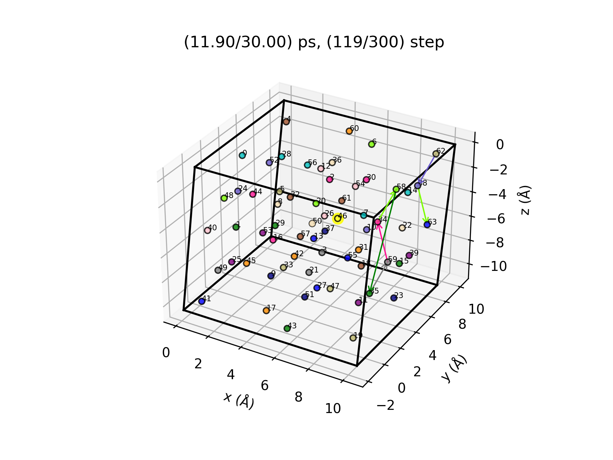
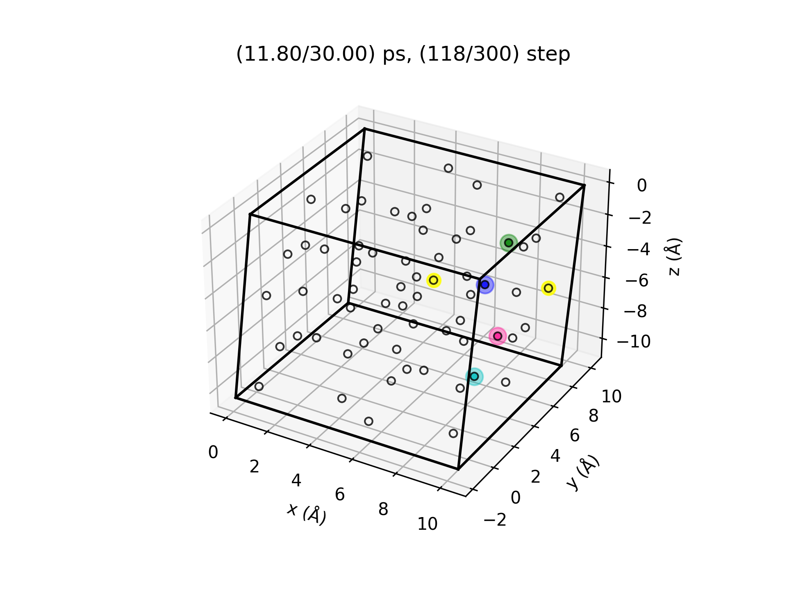
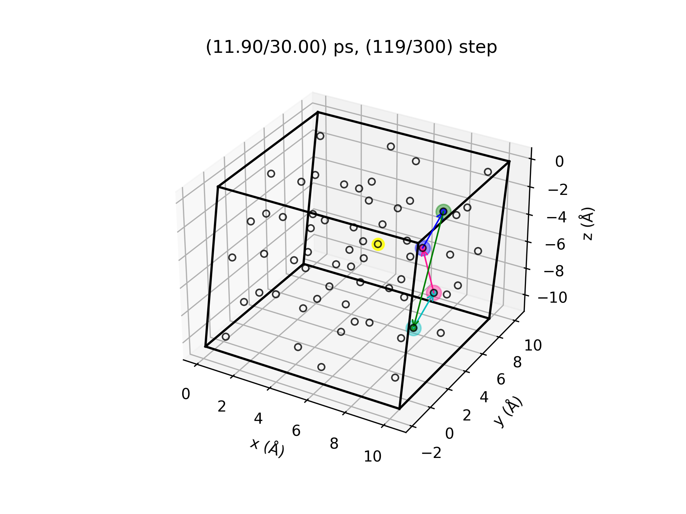
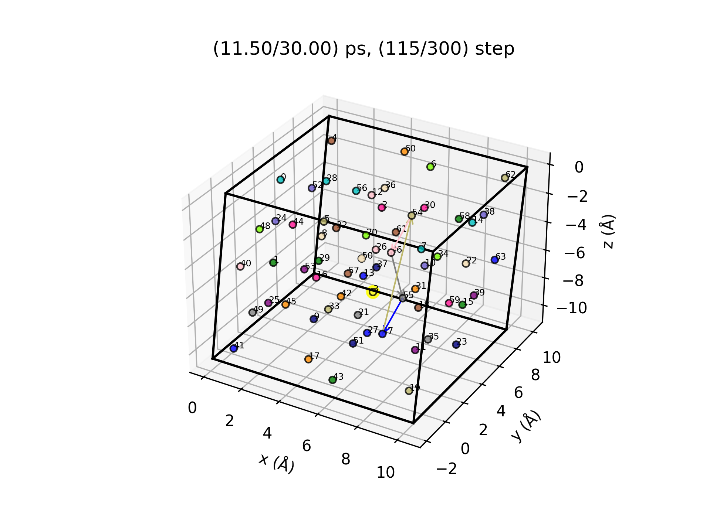
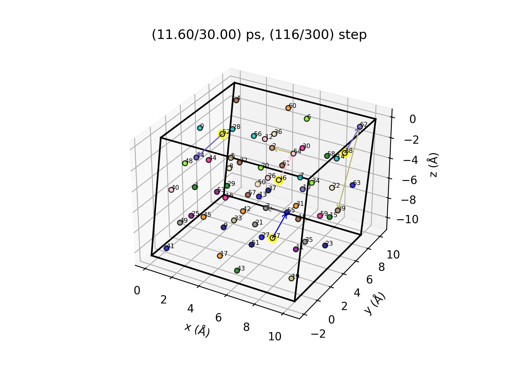
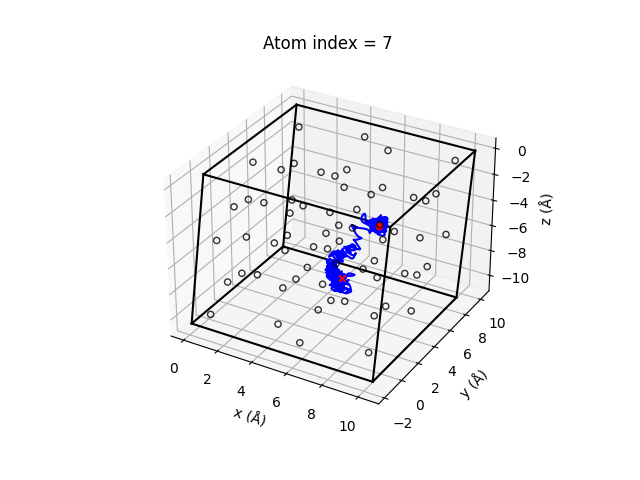
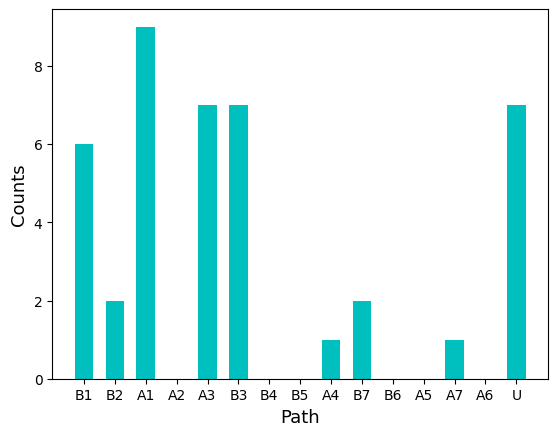
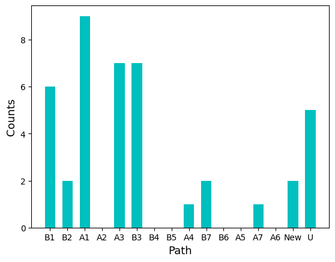
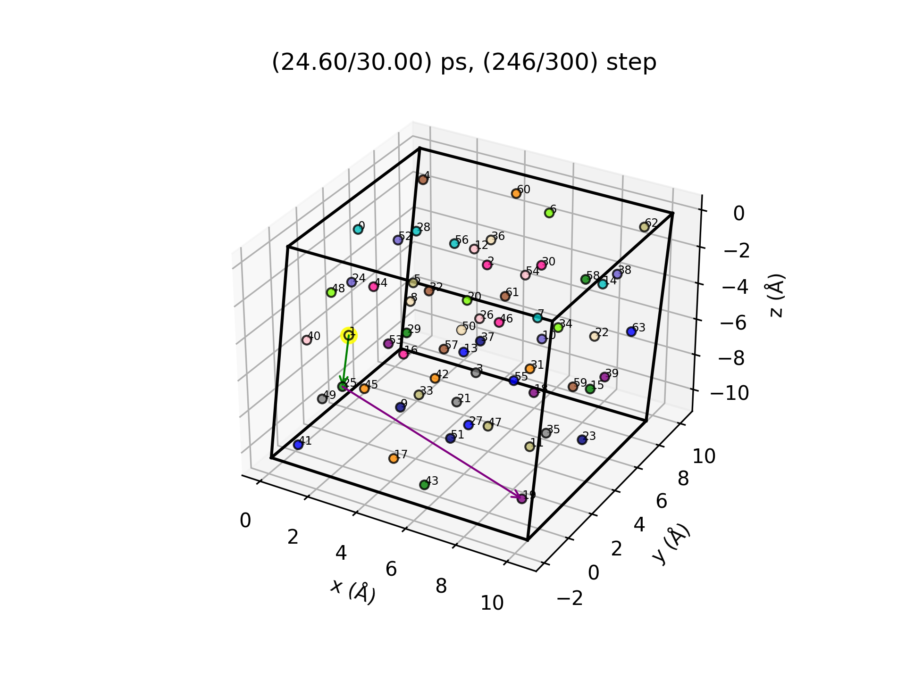
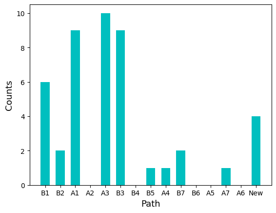

# VacHopPy 
---
**VacHopPy** is a Python package to analyze trajectory of vacancy hopping in materials. This module was developed based on VASP 5.4.4 and Python 3.11.5.

## Features
* Tracking vacancy in *ab-inito* molecular dynamics (AIMD).
* Calculating mass transport parameters of vacancies.
* Analyzing structure changes during AIMD.

## Contents
* Getting started
* Step by step examples
  * Tracking vacancy
    * Making animation
    * Distribution of hopping path
  * Mass transsport parameter calculation
    * Diffusion coefficient 
    * Atomic vibration coefficient
  * Fingerprint of structure
  
## Getting started
*will be updated*

## Step by step examples
---
## Tracking vacancy
>  For the following example, the user can use files in `VacHopPy/example/1.LatticeHopping/data.zip`, which contains MD trajectory of monoclinic HfO<SUB>2</SUB> with one V<SUB>O</SUB><SUP>2+</SUP> at the temperature of 2200 K. 

The core module for vacancy trajectory analysis is `trajectory.LatticeHopping`.
```ruby
from vachoppy import trajectory

traj = trajectory.LatticeHopping(poscar_perf='data/POSCAR_novac',
                                 xdatcar='data/XDATCAR_01',
                                 interval=50, 
                                 target='O')
```
The `poscar_perf` is the path to POSCAR  of perfect crystalline and is used to construct lattice points. The `xdatcar` is XDATCAR of defective cell containing one vacancy, obtaind from AIMD. To alleviate thermal fluctuation, the positions of each atoms are averaged at specified `interval`. Therefore, if the user ran AIMD for 15000 iterations and used an interval of 50, VacHopPy considers the trajectory of AIMD to be composed of 300 (=15000/50) steps and generate 300 averaged structures from each step. Note that the **position of each atoms are determined to the nearest lattice point** from the averaged position at each step. The `target` specifies which atom will be traced. For example, `target='O'` will trace oxgen ions and an oxygen vacancy.

The method of allocating the nearest lattice point might cause unexpected issues, such as multiple vacancies existing simultaneously (**multi-vacancy issue**) or multiple sequential hopping occuring within one step (**multi-hopping issue**). VacHopPy provides correction functions for the issues, will be addressed later.

> The `trajectory` module assumes that lattice points are maintained during MD simulation. It is well known that monoclinic lattice of HfO<SUB>2</SUB> becomes unstable, so that the MD trajectory at 2200 K is an inappropriate case. Nevertheless, the following examples were written using the MD trajetory at 2200 K in order to explain how to address the unexpected issues.


### Making animation
Using `trajectory.LatticeHopping.animation` method, the user can easily generate the animation of vacancy movements. By default arguments, the animation is saved in `traj.gif` and the snapshots are saved in the `./gif` directory.
```ruby
traj.animation(potim=2, # time interval in AIMD
               fps=30)
```
The user can customize the animation by specifying arguments desribed in ***link***. Below is an example animation of oxygen vacancy hopping in monoclinic HfO<SUB>2</SUB> at the temperature of 2200K.
<div align=center>
<p>
    
</p>
</div>

The **oxygen vacancy** is represented by a **yellow color**, while other colored points correspond to occupied lattice points by oxgen ions. The movements of oxygen ions are displayed with arrows of the same color.

Note that not only hoppings through the vacancy, but also site-exchanges between oxygein ions are also observed, indicating that the lattice hopping is not the only mechanism of oxygen transport.

For example, below is a snapshot at step 119. The oxygen ions labeled by 34(magenta), 35(green), 58(light green), 59(grey) exchanged their site, according to the hourglass shape arrows. (The labels can be displayed by setting `label=True`) For your information, the hourglass-type transport corresponds to the motion of optical phonon with the lowest frequency.

<div align=center>
<p>
    
</p>
</div>

Using `trajectory.LatticeHopping.save_traj_on_lat` method, the user can focus on the interested atoms and steps. For example, the movements of ions within the hourglass will be shown by the following code.

```ruby
traj.save_traj_on_lat(lat_point=[34, 35, 58, 59],
                      step=[118, 119],
                      vac=True,
                      label=False)
```

This code will save the snapshots in `./traj_on_lat` directory. In the snapshots, the initial sites are represented by background colors, as shown below.
<div align=center>
<p>
     
    
</p>
</div>

Note that two oxygen vacancies were observed at step 118, which corresponds to the multi-vacancy issue. As expected, the left one is the actual oxygen vacancy, while the right one is a **transient vacancy** caused by large thermal fluctuations.


### Correction for multi-vacancy issue
The straightforward way to correct the multi-vacancy issue is to use the connectivity information between previous and present steps. 
<div align=center>
<p>
     
    
</p>
</div>

There was only one vacancy at the lattice point labeled as 3 in step 115, but four vacancies were observed in step 116 at the lattice points labeled as 38, 46, 47, and 52. However, considering the movements of oxygen ions represented by the arrows, we can see that the oxygen vacancy moved via 3 ➔ 55 ➔ 47. Indeed, the other transient vacancies will vanish in a few steps.

> The original monoclinic lattice changes to a tetragonal-like lattice during steps 100 to 140. (See fingerprint section) Since our code assumes the lattice remains constant, this change is beyond the scope of our code and results in many trasient vacancies being observed. For common cases, where the lattice is preserved, the multi-vacancy issue is rarely observed.

Excluding the transient vacancies based on the connectivity can be done using the following command.
```ruby
traj.check_connectivity(start=1)
```
By this command, VacHopPy seqeuntially investigates the connectivity of the vacancy path from step 1 and automatically eliminates the transient vacancies. However, in this example, the user will receive the following message.
```
there is no connected site.
find the vacancy site for your self. (step: 127)
```
When the user recieve the above message, the user should check: 
* Whether any transport mechanisms other than lattice hopping have occured (e.g. kick-out mechanism).
* Whether the lattice remains consistent throughout the simulation.

If needed, the user should manually specify the correct vacancy site at the step.
```ruby
# manually designate the vacancy site in step 127 to 7
traj.update_vac(step=127, lat_point=7) 
traj.check_connectivity(start=127)
```
The user can check the existence of the transient vacancies using `check_unique_vac` method:
```ruby
traj.check_unique_vac()
```
If all transient vacancies are successfully removed, the message 'vacancy is unique.' will be displayed.

<br/>

### Appendix 1: Save POSCAR
One can get a POSCAR file of a certain step with `save_poscar` method.
```ruby
traj.save_poscar(step)
``` 

<br/>


### Appendix 2: Save real trajectory
One can get real trajectory (not projected on the lattice points) of each atoms with `save_traj` method.

```ruby
traj.save_traj() 
```
The trajectory of each atom will be saved in `./traj` directory. Below is an example of the outputs, where the red O and X markers represent the initial and final position of the atom, respectively.

<div align=center>
<p>
     
</p>
</div>

---
## How to analyze the hopping path

The core module to investigate the hopping path of vacancy in MD trajectory is `trajectory.Analyzer`. To use this module, information on the hopping paths within the material is required. For example, in monoclinic HfO<SUB>2</sUB>, there are two distinguishable oxygen sites  named **cn3** and **cn4**, referring to their coordination numbers. Additionally, there are 14 diffusion paths for V<SUB>O</SUB><SUP>2+</SUP>, as listed below. The z specifies the number of equivalent paths, and the names are arbitrary defined.

<div align=center>

|Name|Initial site|Final site|Distance (Å)|E<SUB>a</SUB> (eV)| ΔE (eV) | z
|:---:|:---:|:---:|:---:|:---:|:---:|:---:|
|A1|cn3|cn4|2.542|0.74|0.65|1|
|A2|cn3|cn3|2.574|0.84|0|1|
|A3|cn3|cn3|2.785|0.85|0|2|
|A4|cn3|cn3|2.837|1.35|0|2|
|A5|cn3|cn4|2.937|1.91|0.65|1|
|A6|cn3|cn4|2.965|2.07|0.65|1|
|A7|cn3|cn4|2.989|2.01|0.65|1|
|B1|cn3|cn3|2.542|0.08|-0.65|1|
|B2|cn3|cn4|2.576|0.32|0|1|
|B3|cn3|cn4|2.662|0.86|0|2|
|B4|cn3|cn4|2.724|0.98|0|1|
|B5|cn3|cn3|2.937|1.25|-0.65|1|
|B6|cn3|cn3|2.965|1.42|-0.65|1|
|B7|cn3|cn3|2.989|1.36|-0.65|1|

</div>

### Prepare for hopping path analysis
To prepare for hopping path analysis using the `trajectory.Analyzer module`, follow these steps:
1. Instantiate the Analyzer:
  
Create an instance of `trajectory.Analyzer`, passing in an instance of **trajectory.LatticeHopping** as an argument.

```ruby
anal_hfo2 =  trajectory.Analyzer(traj=traj)
```
<br/>

2. Specify the hopping paths manually:

Since VacHopPy classifies the hopping paths based on distance, it is crucial to provide accurate distance values (defaults tolerance = 0.001).
```ruby
final_A = ['cn4', 'cn3', 'cn3', 'cn3', 'cn4', 'cn4', 'cn4']
final_B = ['cn3', 'cn4', 'cn4', 'cn4', 'cn3', 'cn3', 'cn3']

d_A = [2.542, 2.574, 2.785, 2.837, 2.937, 2.965, 2.989]
d_B = [2.542, 2.576, 2.662, 2.724, 2.937, 2.965, 2.989]

Ea_A = [0.74, 0.84, 0.85, 1.35, 1.91, 2.07, 2.01]
Ea_B = [0.08, 0.32, 0.86, 0.98, 1.25, 1.42, 1.36]

for i in range(7):
    anal_hfo2.add_path(f"A{i+1}", 'cn3', final_A[i], d_A[i], Ea_A[i])
    anal_hfo2.add_path(f"B{i+1}", 'cn4', final_B[i], d_B[i], Ea_B[i])

```

3. Print path data
Print the path data to verify the added paths.
```ruby
anal_hfo2.print_path()
```

4. Specify type of lattice points:

Manually specify the type of lattice points. The kinds of type can vary depending on the material.

```ruby
for lat_p in anal_hfo2.lat_points:
    x_coord = lat_p['coord'][0]
    if 0.13796 < x_coord < 0.36204 or 0.63796 < x_coord < 0.86204:
        lat_p['site'] = 'cn4'
    else:
        lat_p['site'] = 'cn3'
```

### Get hopping paths of vacancy
When the `Analyzer.search_path_vac()` method is executed, VacHopPy will search for hopping paths at each step based on distance data provided.

```ruby
anal_hfo2.search_path_vac()
anal_hfo2.print_summary(sort=True)
```

This command will display the hopping sequence and the bar graph for path distribution. With `sort=True`, the paths are sorted according to the hopping barriers (E<SUB>a</SUB>).
```
# Example results
unknown steps are detected.: [116, 118, 125, 127, 186, 246, 247]
xdatcar file : data/XDATCAR_01
poscar_per file: data/POSCAR_novac

total counts : 42
hopping sequence :
A3 A3 A3 A3 A1 B1 A1 B2 B2 B1 A3 A1 B1 A3 A3 A4 A1 B7 A1 unknown unknown A1 unknown unknown B1 A1 B1 unknown A1 B3 B3 B3 B3 B3 B3 unknown unknown B7 A7 B1 A1 B3 
maximum Ea : 2.01 eV
```
<div align=center>
<p>
     
</p>
</div>

Note that 7 unknown paths were observed. The unknown paths can appear due to two main reasons: 

 1. Existence of a new hopping path.

 By examining the unknown paths, we found a new hopping path whose distance and barrier are 3.6471 Å and 3.94 eV. After adding the new path, the user can see the counts of unknown paths decreased from 7 to 5, while the counts of the new path became 2.
 ```ruby
 anal_hfo2.add_path('New', 'cn4', 'cn4', 3.6471, 3.94)
 anal_hfo2.print_summary(sort=True)
 ```

<div align=center>
<p>
     
</p>
</div>
 

 2. Multi-path issue.

 As an example of the multi-path issue, below is a snapshot at step 246, showing that two sequential hopping, 19(purple) ➔ 25(green) and 25(green) ➔ 1(yellow), take place during one step. However, since VacHopPy determines the displacement of vacancy in step-wise manner, the code interprets the vacancy as moving directly 19(pulple) ➔ 1(yellow).

<div align=center>
<p>
     
</p>
</div>

### Correction for multi-path issue

The multi-path issue can be addressed by using `Analyze.unwrap_path()` method, which recursively decomposes the multi-paths. This method can smartly find a possible path of vacancy by considering both connectivity and direction of arrows. By executing below commands, the user can see that unknown paths disapear and the total counts increas from 42 to 45.

```ruby
anal_hfo2.unwrap_path()
anal_hfo2.print_summary()
```

```
no unknown path exist.
xdatcar file : data/XDATCAR_01
poscar_per file: data/POSCAR_novac

total counts : 45
hopping sequence :
A3 A3 A3 A3 A1 B1 A1 B2 B2 B1 A3 A1 B1 A3 A3 A4 A1 B7 A1 B5 A3 A3 A3 A1 New New B1 A1 B1 A1 B3 B3 B3 B3 B3 B3 New B3 B3 New B7 A7 B1 A1 B3 
maximum Ea : 3.94 eV
```

<div align=center>
<p>
     
</p>
</div>

**New path 정의 안할 시 125, 127 unknown path가 사라지는 오류 확인. code 수정 필요** 

---
## Fingerprint

While the `vachoppy.trajectory` module aims to analyze systems with a maintained lattice during the MD simulation, some users may want to study changes in the lattice during the simulation.

