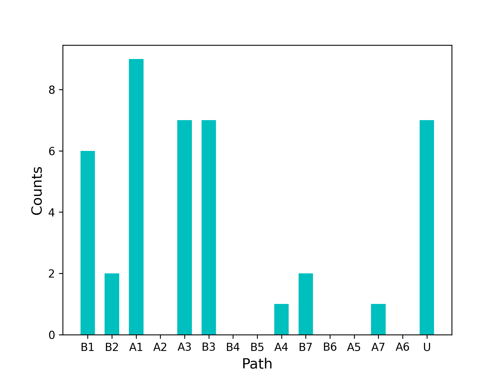
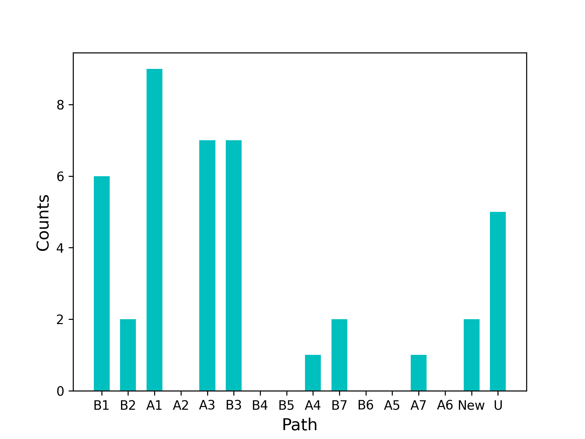
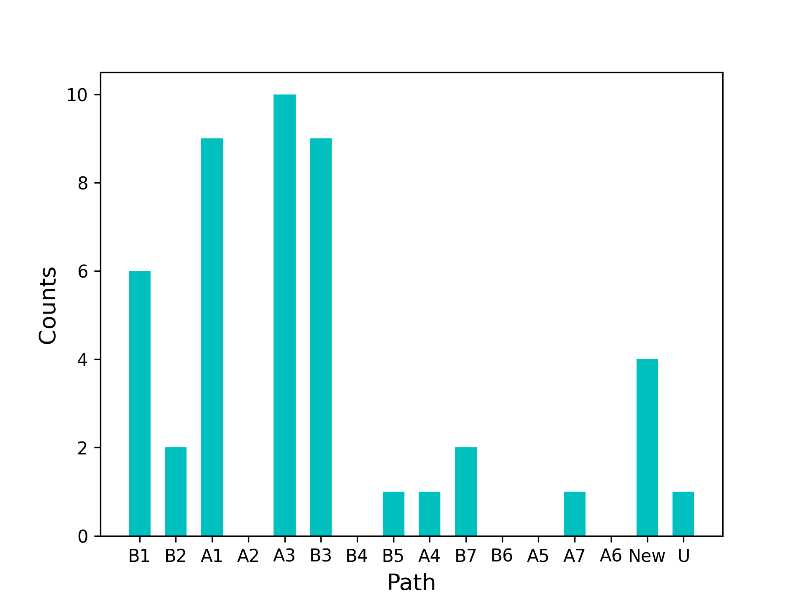
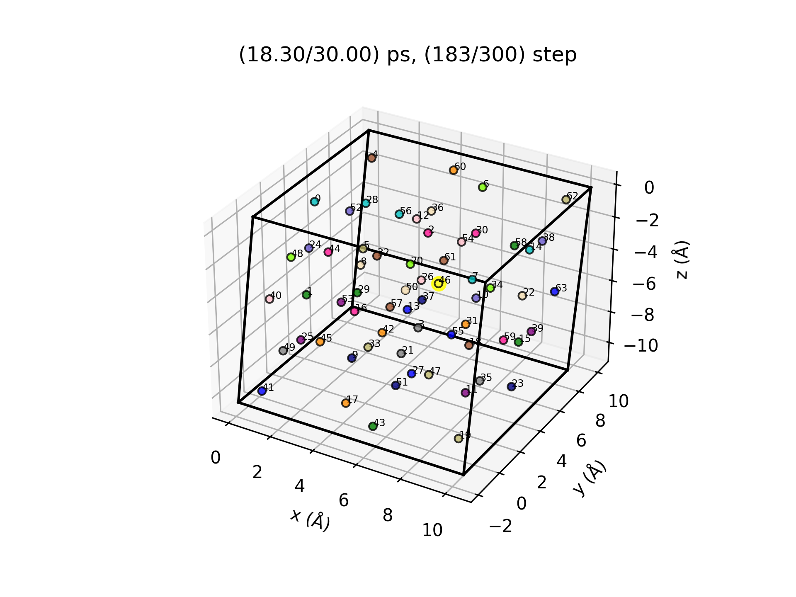
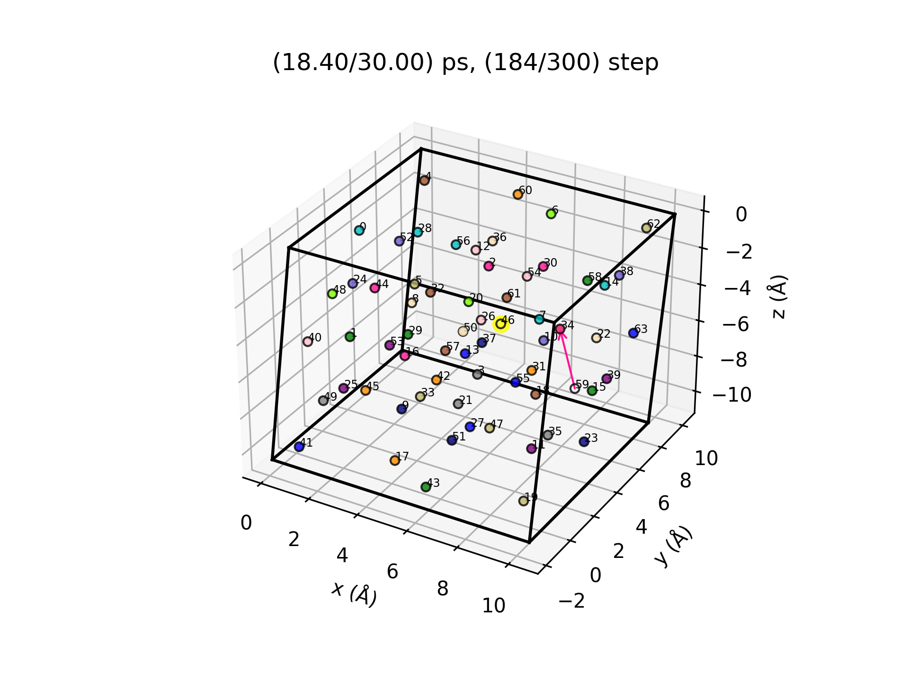
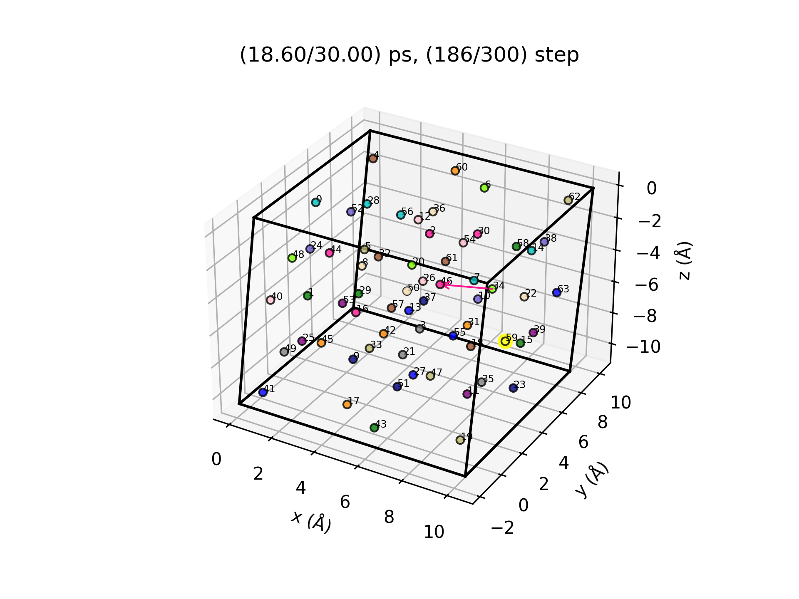
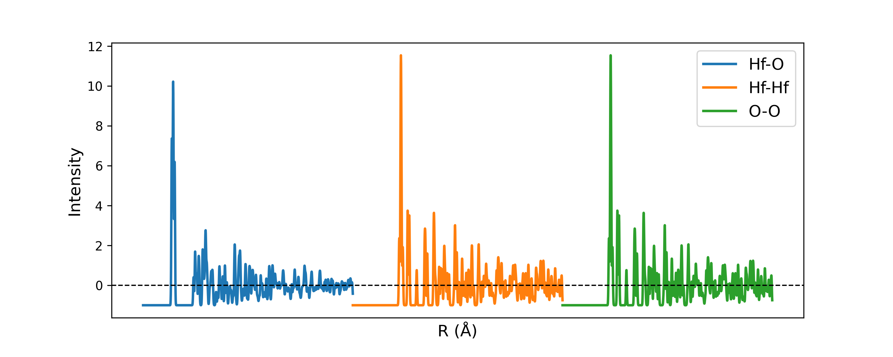
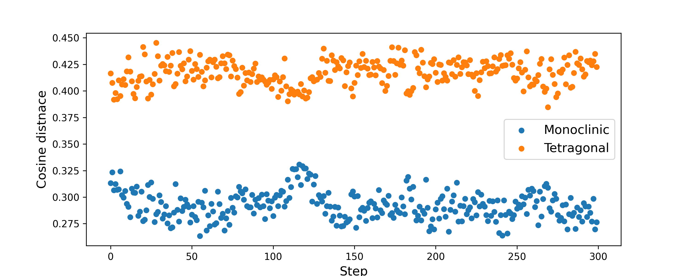

# VacHopPy 
---
**VacHopPy** is a Python package to analyze trajectory of vacancy hopping mechanisms, based on *Ab initio* molecular dynamics (AIMD) simulations.

<div align=center>
<p>
    
</p>
</div>


A Key improvement in **VacHopPy** is introducing an **effective hopping parameter** set. The hopping parameters inherently depend on the selction of hopping paths, resulting in multiple sets of hopping parameters within a given lattice. However, to utilizt the *ab initio* hopping parameters in macroscopic simulations (e.g., TCAD, continuum model, KMC method), a well-defined, single effective hopping parameter set encompassing all hopping paths is necessary since the presence of multiple hopping paths is commonly not considered in the macroscopic equations.

<div align=center>
<p>
    
</p>
</div>

## Features
* Simultaneous calculation of **effective hopping parameters**
* Tracking of vacancy trajectories in AIMD simulations
* Assessment of lattice stability or phase transitions

Belows are a list of effective hopping parameters which can be obtained from **VacHopPy**:

|Symbol|Description|
|:---:|---|
|D<SUB>0</SUB>|Pre-exponential of diffusion coefficient (m<SUP>2</SUP>/s)|
|E<SUB>a</SUB>|Hopping barrier (eV)|
|a|Hopping distance (Å)|
|z|Coordination number|
|ν|Jump attempt frequency (THz)|
|f|Correlation factor|


## Contents
* Installation
* How to implement
  * Vacancy trajectory determination
    * Making animation
    * Distribution of hopping path
  * Effective hopping parameter calculation
    * Diffusion coefficient 
    * Atomic vibration coefficient
  * Assessment of lattice stability
  
## Installation
*will be updated*


## Step by step examples
---
## Tracking vacancy
>  For the following example, the user can use files in `VacHopPy/example/1.LatticeHopping/data.zip`, which contains MD trajectory of monoclinic HfO<SUB>2</SUB> with one V<SUB>O</SUB><SUP>2+</SUP> at the temperature of 2200 K. 

The core module for vacancy trajectory analysis is `trajectory.LatticeHopping`.
```ruby
from vachoppy import trajectory

traj = trajectory.LatticeHopping(poscar_perf='data/POSCAR_novac',
                                 xdatcar='data/XDATCAR_01',
                                 interval=50, 
                                 target='O')
```
The `poscar_perf` is the path to POSCAR  of perfect crystalline and is used to construct lattice points. The `xdatcar` is XDATCAR of defective cell containing one vacancy, obtaind from AIMD. To alleviate thermal fluctuation, the positions of each atoms are averaged at specified `interval`. Therefore, if the user ran AIMD for 15000 iterations and used an interval of 50, VacHopPy considers the trajectory of AIMD to be composed of 300 (=15000/50) steps and generate 300 averaged structures from each step. Note that the **position of each atoms are determined to the nearest lattice point** from the averaged position at each step. The `target` specifies which atom will be traced. For example, `target='O'` will trace oxgen ions and an oxygen vacancy.

The method of allocating the nearest lattice point might cause unexpected issues, such as multiple vacancies existing simultaneously (**multi-vacancy issue**) or multiple sequential hopping occuring within one step (**multi-hopping issue**). VacHopPy provides correction functions for the issues, will be addressed later.

> The `trajectory` module assumes that lattice points are maintained during MD simulation. It is well known that monoclinic lattice of HfO<SUB>2</SUB> becomes unstable, so that the MD trajectory at 2200 K is an inappropriate case. Nevertheless, the following examples were written using the MD trajetory at 2200 K in order to explain how to address the unexpected issues.


### Making animation
Using `trajectory.LatticeHopping.animation` method, the user can easily generate the animation of vacancy movements. By default arguments, the animation is saved in `traj.gif` and the snapshots are saved in the `./gif` directory.
```ruby
traj.animation(potim=2, # time interval in AIMD
               fps=30)
```
The user can customize the animation by specifying arguments desribed in ***link***. Below is an example animation of oxygen vacancy hopping in monoclinic HfO<SUB>2</SUB> at the temperature of 2200K.
<div align=center>
<p>
    
</p>
</div>

The **oxygen vacancy** is represented by a **yellow color**, while other colored points correspond to occupied lattice points by oxgen ions. The movements of oxygen ions are displayed with arrows of the same color.

Note that not only hoppings through the vacancy, but also site-exchanges between oxygein ions are also observed, indicating that the lattice hopping is not the only mechanism of oxygen transport.

For example, below is a snapshot at step 119. The oxygen ions labeled by 34(magenta), 35(green), 58(light green), 59(grey) exchanged their site, according to the hourglass shape arrows. (The labels can be displayed by setting `label=True`) For your information, the hourglass-type transport corresponds to the motion of optical phonon with the lowest frequency.

<div align=center>
<p>
    
</p>
</div>

Using `trajectory.LatticeHopping.save_traj_on_lat` method, the user can focus on the interested atoms and steps. For example, the movements of ions within the hourglass will be shown by the following code.

```ruby
traj.save_traj_on_lat(lat_point=[34, 35, 58, 59],
                      step=[118, 119],
                      vac=True,
                      label=False)
```

This code will save the snapshots in `./traj_on_lat` directory. In the snapshots, the initial sites are represented by background colors, as shown below.
<div align=center>
<p>
     
    
</p>
</div>

Note that two oxygen vacancies were observed at step 118, which corresponds to the multi-vacancy issue. As expected, the left one is the actual oxygen vacancy, while the right one is a **transient vacancy** caused by large thermal fluctuations.


### Correction for multi-vacancy issue
The straightforward way to correct the multi-vacancy issue is to use the connectivity information between previous and present steps. 
<div align=center>
<p>
     
    
</p>
</div>

There was only one vacancy at the lattice point labeled as 3 in step 115, but four vacancies were observed in step 116 at the lattice points labeled as 38, 46, 47, and 52. However, considering the movements of oxygen ions represented by the arrows, we can see that the oxygen vacancy moved via 3 ➔ 55 ➔ 47. Indeed, the other transient vacancies will vanish in a few steps.

> The original monoclinic lattice changes to a tetragonal-like lattice during steps 100 to 140. (See fingerprint section) Since our code assumes the lattice remains constant, this change is beyond the scope of our code and results in many trasient vacancies being observed. For common cases, where the lattice is preserved, the multi-vacancy issue is rarely observed.

Excluding the transient vacancies based on the connectivity can be done using the following command.
```ruby
traj.check_connectivity(start=1)
```
By this command, VacHopPy seqeuntially investigates the connectivity of the vacancy path from step 1 and automatically eliminates the transient vacancies. However, in this example, the user will receive the following message.
```
there is no connected site.
find the vacancy site for your self. (step: 127)
```
When the user recieve the above message, the user should check: 
* Whether any transport mechanisms other than lattice hopping have occured (e.g. kick-out mechanism).
* Whether the lattice remains consistent throughout the simulation.

If needed, the user should manually specify the correct vacancy site at the step.
```ruby
# manually designate the vacancy site in step 127 to 7
traj.update_vac(step=127, lat_point=7) 
traj.check_connectivity(start=127)
```
The user can check the existence of the transient vacancies using `check_unique_vac` method:
```ruby
traj.check_unique_vac()
```
If all transient vacancies are successfully removed, the message 'vacancy is unique.' will be displayed.

<br/>

### Appendix 1: Save POSCAR
One can get a POSCAR file of a certain step with `save_poscar` method.
```ruby
traj.save_poscar(step)
``` 

<br/>


### Appendix 2: Save real trajectory
One can get real trajectory (not projected on the lattice points) of each atoms with `save_traj` method.

```ruby
traj.save_traj() 
```
The trajectory of each atom will be saved in `./traj` directory. Below is an example of the outputs, where the red O and X markers represent the initial and final position of the atom, respectively.

<div align=center>
<p>
     
</p>
</div>

---
## How to analyze the hopping path

The core module to investigate the hopping path of vacancy in MD trajectory is `trajectory.Analyzer`. To use this module, information on the hopping paths within the material is required. For example, in monoclinic HfO<SUB>2</sUB>, there are two distinguishable oxygen sites  named 'cn3' and 'cn4', referring to their coordination numbers. Additionally, there are 14 diffusion paths for V<SUB>O</SUB><SUP>2+</SUP>, as listed below. The z specifies the number of equivalent paths, and the names are arbitrary defined.

<div align=center>

|Name|Initial site|Final site|Distance (Å)|E<SUB>a</SUB> (eV)| ΔE (eV) | z
|:---:|:---:|:---:|:---:|:---:|:---:|:---:|
|A1|cn3|cn4|2.542|0.74|0.65|1|
|A2|cn3|cn3|2.574|0.84|0|1|
|A3|cn3|cn3|2.785|0.85|0|2|
|A4|cn3|cn3|2.837|1.35|0|2|
|A5|cn3|cn4|2.937|1.91|0.65|1|
|A6|cn3|cn4|2.965|2.07|0.65|1|
|A7|cn3|cn4|2.989|2.01|0.65|1|
|B1|cn3|cn3|2.542|0.08|-0.65|1|
|B2|cn3|cn4|2.576|0.32|0|1|
|B3|cn3|cn4|2.662|0.86|0|2|
|B4|cn3|cn4|2.724|0.98|0|1|
|B5|cn3|cn3|2.937|1.25|-0.65|1|
|B6|cn3|cn3|2.965|1.42|-0.65|1|
|B7|cn3|cn3|2.989|1.36|-0.65|1|

</div>

### Prepare for hopping path analysis
To prepare for hopping path analysis using the `trajectory.Analyzer` module, follow these steps:
1. Instantiate the Analyzer:
  
Create an instance of `trajectory.Analyzer`, passing in an instance of **trajectory.LatticeHopping** as an argument.

```ruby
anal_hfo2 =  trajectory.Analyzer(traj=traj)
```
<br/>

2. Specify the hopping paths manually:

Since VacHopPy classifies the hopping paths based on distance, it is crucial to provide accurate distance values (defaults tolerance = 0.001).
```ruby
final_A = ['cn4', 'cn3', 'cn3', 'cn3', 'cn4', 'cn4', 'cn4']
final_B = ['cn3', 'cn4', 'cn4', 'cn4', 'cn3', 'cn3', 'cn3']

d_A = [2.542, 2.574, 2.785, 2.837, 2.937, 2.965, 2.989]
d_B = [2.542, 2.576, 2.662, 2.724, 2.937, 2.965, 2.989]

Ea_A = [0.74, 0.84, 0.85, 1.35, 1.91, 2.07, 2.01]
Ea_B = [0.08, 0.32, 0.86, 0.98, 1.25, 1.42, 1.36]

for i in range(7):
    anal_hfo2.add_path(f"A{i+1}", 'cn3', final_A[i], d_A[i], Ea_A[i])
    anal_hfo2.add_path(f"B{i+1}", 'cn4', final_B[i], d_B[i], Ea_B[i])

```

3. Print path data
Print the path data to verify the added paths.
```ruby
anal_hfo2.print_path()
```

4. Specify type of lattice points:

Manually specify the type of lattice points. The kinds of type can vary depending on the material.

```ruby
for lat_p in anal_hfo2.lat_points:
    x_coord = lat_p['coord'][0]
    if 0.13796 < x_coord < 0.36204 or 0.63796 < x_coord < 0.86204:
        lat_p['site'] = 'cn4'
    else:
        lat_p['site'] = 'cn3'
```

### Get hopping paths of vacancy
When the `Analyzer.search_path_vac()` method is executed, VacHopPy will search for hopping paths at each step based on distance data provided. By executing the below commands, the user can see informatoin on the hopping sequence and a bar graph for the path counts.  With default settings, the paths in the bar graph are sorted in ascending order of hopping barriers (E<SUB>a</SUB>).

```ruby
anal_hfo2.search_path_vac()
anal_hfo2.print_summary()
```

```
# Example results
unknown steps are detected.: [116, 118, 125, 127, 186, 246, 247]
xdatcar file : data/XDATCAR_01
poscar_per file: data/POSCAR_novac

total counts : 42
hopping sequence :
A3 A3 A3 A3 A1 B1 A1 B2 B2 B1 A3 A1 B1 A3 A3 A4 A1 B7 A1 unknown unknown A1 unknown unknown B1 A1 B1 unknown A1 B3 B3 B3 B3 B3 B3 unknown unknown B7 A7 B1 A1 B3 
maximum Ea : 2.01 eV
```

<div align=center>
<p>
     
</p>
</div>


VacHopPy found 42 hopping sequences, but there were 7 unknown path. The counts for unknown path is represented by 'U' in the bar graph. The unknown paths can appear due to three main reasons: 

#### 1. Existence of a new hopping path.

By examining the unknown paths, we found a new hopping path whose distance and barrier are 3.6471 Å and 3.94 eV. After adding the new path, the user can see the counts of unknown paths decreased from 7 to 5, while the counts of the new path became 2.
 ```ruby
 anal_hfo2.add_path('New', 'cn4', 'cn4', 3.6471, 3.94)
 anal_hfo2.search_path_vac()
 anal_hfo2.print_summary()
 ```

<div align=center>
<p>
     
</p>
</div>
 

 #### 2. Multi-path issue

As an example of the multi-path issue, below is a snapshot at step 246, showing that two sequential hopping, 19(purple) ➔ 25(green) and 25(green) ➔ 1(yellow), take place during one step. However, since VacHopPy determines the displacement of vacancy in step-wise manner, the code interprets the vacancy as moving directly 19(pulple) ➔ 1(yellow).

<div align=center>
<p>
     
</p>
</div>

The multi-path issue can be addressed by using `Analyze.unwrap_path()` method, which recursively decomposes the multi-paths. This method can smartly find a possible path of vacancy by considering both connectivity and direction of arrows. By executing below commands, the user can see that the number of unknown paths decreased from 5 to 1 and the total counts increased from 42 to 46.

```ruby
anal_hfo2.unwrap_path()
anal_hfo2.print_summary()
```

```
unknown path exist.
step: 186 
xdatcar file : data/XDATCAR_01
poscar_per file: data/POSCAR_novac

total counts : 46
hopping sequence :
A3 A3 A3 A3 A1 B1 A1 B2 B2 B1 A3 A1 B1 A3 A3 A4 A1 B7 A1 B5 A3 A3 A3 A1 New New B1 A1 B1 unknown A1 B3 B3 B3 B3 B3 B3 New B3 B3 New B7 A7 B1 A1 B3 
maximum Ea : 3.94 eV
```

<div align=center>
<p>
     
</p>
</div>


<br/>

#### 3. A new mechanism other than lattice hopping

If the unknown paths remains after going through all of the above processes, it is likely that a mechanism other than lattice hopping is at work. In our example, the unknown path still remains at step 186. To examine the unknown step, snapshots arounds step 186 are shown below. In step 184, the oxygen ion at site 59 (magenta) moves close to the oxygen ion at site 34 (light green). This process generates a transient vacancy at site 59, and two oxygen ions are simultaneously located at nearby site 34. Subsequently, in step 186, the magenta oxygen ion moves to site 46, the position where the vacancy was initially located, and fills the site. Finally, the transient vacancy at site 59 becomes a new vacancy site.

<div align=center>
<p>
     
     
     
</p>
</div>

**However, the user should keep in mind that most unnatural movements of vacancy are attributed to changes in lattice points, which is beyond the scope of `trajectory` module.** The straightforward way to check whether the lattice changes is by using the **fingerprint** of the structure.

> We note that the lattice in this example is unstable since the MD simulation was executed at a temperature of 2200 K. The monoclinic lattice is only stable below 2000 K. When the lattice is stable at temperatures lower than 2000 K, only the lattice hopping mechanism is observed.


---
## Fingerprint

Fingerprint of an atomic structure, as proposed by Oganov *et al.*<SUP>[1]</SUP>, can be derived using VacHopPy The fingerprint of two atomic type pairs $A$ and $B$ is represented as follows:

$$
F_{AB}(R)=\sum\limits_{A_i, cell}\sum\limits_{B_j} (\frac{δ(R-R_{ij})}{4πR_{ij}^2 \frac{N_{A}N_{B}}{V}Δ}) - 1
$$

The double sum runs over all $A$ atoms in the unit cell and $B$ atoms within the threshold distance $R_{max}$ from the $A_{i}$ atom. Here, $δ$ is Gaussian-smeared delta function, and the $Δ$ is the bin size that descretizes the radial distance. A well-established fingerprint function should satisfy $F_{AB}(0)=-1$ and $F_{AB}(∞)=0$.

Using the fingerprint function, one can measure the similarity of two atomic structure. A straghtforwad way to quantify the similarity is using cosine distance:

$$
D_{cos} = \frac{1}{2}(1-\frac{\mathbf{F_1}⋅\mathbf{F_2}}{|\mathbf{F_1}||\mathbf{F_2}|})
$$

$D_{cos}$ has a vaule range from 0 to 1, with a smaller value indicating more similarity between two fingerprints, $\mathbf{F_1}$ and $\mathbf{F_2}$. The fingerprint and cosine distance can simply utilized using the `vachoppy.fingerprint` module. Two examples showing how to use this module are provided below.


### Example 1: Fingerprint of monoclinic HfO<SUB>2</SUB> 

The fingerprint of monoclinic HfO<SUB>2</SUB> can be obtained by executing the following commands. The user should select adequate Rmax, delta, and sigma, which satisfy $F_{AB}(0)=-1$ and $F_{AB}(∞)=0$.

```ruby
import matplotlib.pyplot as plt
from vachoppy.fingerprint import FingerPrint

# path of poscar
poscar = 'data/poscars_hfo2/POSCAR_mHfO2'

# parameters of fingerprints
Rmax, delta, sigma = 15, 0.01, 0.03

# get fingerprint function
fp_hfo = FingerPrint('Hf','O', poscar, Rmax, delta, sigma)
fp_hfhf = FingerPrint('Hf','Hf', poscar, Rmax, delta, sigma)
fp_oo = FingerPrint('Hf','Hf', poscar, Rmax, delta, sigma)

# plot fingerprints
x_hfo = fp_hfo.R
x_hfhf = fp_hfhf.R + x_hfo[-1]
x_oo = fp_oo.R + x_hfhf[-1]

plt.figure(figsize=(10, 4))
plt.plot(x_hfo, fp_hfo.fingerprint, linewidth=2, label='Hf-O')
plt.plot(x_hfhf, fp_hfhf.fingerprint, linewidth=2, label='Hf-Hf')
plt.plot(x_oo, fp_oo.fingerprint, linewidth=2, label='O-O')
plt.axhline(0, 0, 1, color='k', linestyle='--', linewidth=1)

plt.xticks([],[])
plt.xlabel('R (Å)', fontsize=13)
plt.ylabel('Intensity', fontsize=13)

plt.legend(fontsize=13)
plt.show()

```

<div align=center>
<p>
     
</p>
</div>


### Example 2: Change in cosine distance during MD simulation

Below is an example of fingerprint analysis. By executing the commands, cosine distances trends of MD trajectory from monoclinic and tetragonal HfO<SUB>2</SUB> will be obtained. In this example, the MD trajectory of monolclnic HfO<SUB>2</SUB> containinig one V<SUB>O</SUB><SUP>2+</SUP> at 2200 K is used.   


```ruby
import numpy as np
import matplotlib.pyplot as plt
from tqdm import tqdm
from vachoppy.trajectory import LatticeHopping
from vachoppy.fingerprint import FingerPrint, CosineDistance

# parameters for fingerprints
Rmax, delta, sigma = 15, 0.01, 0.03

# fingerprint of monoclinic and tetragonal HfO2
def concatFingerPrint(poscar):
    fp_hfo = FingerPrint('Hf', 'O', poscar, Rmax, delta, sigma).fingerprint
    fp_hfhf = FingerPrint('Hf', 'Hf', poscar, Rmax, delta, sigma).fingerprint
    fp_oo = FingerPrint('O', 'O', poscar, Rmax, delta, sigma).fingerprint
    return np.concatenate((fp_hfo, fp_hfhf, fp_oo))

poscar_m = 'data/poscars_hfo2/POSCAR_mHfO2'
poscar_t = 'data/poscars_hfo2/POSCAR_tHfO2'

fp_m = concatFingerPrint(poscar_m) # fingerprint of monoclinic HfO2
fp_t = concatFingerPrint(poscar_t) # fingerprint of tetragonal HfO2

# fingerprint in MD trajectory

# extract poscars from trajectory
poscar_perf = 'data/POSCAR_novac'
xdatcar = 'data/XDATCAR_01'

traj = LatticeHopping(poscar_perf, xdatcar, 50, 'O')
num_step = traj.num_step

for step in np.arange(num_step):
    traj.save_poscar(step, outdir='poscars_traj')

# get fingerprints of the trajectories
fp_traj = [] # fingerprints of trajectories
for i in tqdm(range(num_step)):
    poscar_i = f'poscars_traj/POSCAR_{i}'
    fp_i = concatFingerPrint(poscar_i)
    fp_traj.append(fp_i)

# get cosine distances
d_m = np.zeros(num_step) # distance from monoclinic HfO2
d_t = np.zeros(num_step) # distance from tetragonal HfO2

for i, fp_i in enumerate(fp_traj):
    d_m[i] = CosineDistance(fp_m, fp_i)
    d_t[i] = CosineDistance(fp_t, fp_i)

# plot cosine distance
x = np.arange(num_step)
plt.figure(figsize=(10, 4))
plt.scatter(x, d_m, s=25, label='Monoclinic')
plt.scatter(x, d_t, s=25, label='Tetragonal')

plt.xlabel("Step", fontsize=13)
plt.ylabel('Cosine distnace', fontsize=13)
plt.legend(fontsize=13)
plt.show()
```

<div align=center>
<p>
     
</p>
</div>

Note that, although the lattice was fixed to monoclnic during MD simulation (NVT ensemble was employed), the cosine distance from the monoclinic increases, while the cosine distance from tetragonal decreases in steps from 100 to 140. Indeed, when one fully relaxes the structure at step 118, corresponding to the maximum porint, a tetragonal HfO<SUB>2</SUB> will be obtained. It implies that the monoclinic lattice is not maintained at the temperature of 2200 K, and the `vachoppy.trajectory` module is not applicable,

---
## Reference
[1] A. R. Ognov and M. Valle, J. Chem. Phys. **130**, 104504 (2009)
