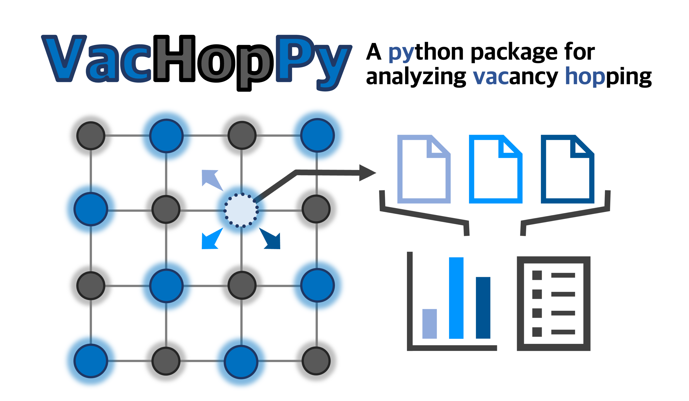

.. vachoppy documentation master file, created by
   sphinx-quickstart on Sat Oct 11 14:05:35 2025.
   You can adapt this file completely to your liking, but it should at least
   contain the root `toctree` directive.

Welcome to VacHopPy's documentation!
====================================

**VacHopPy** is a Python package for analyzing vacancy-mediated diffusion from molecular dynamics (MD) 
simulations. The package facilitates a reliable **multiscale modeling** workflow by calculating key 
vacancy hopping parameters that can be directly incorporated into continuum-scale models.

Key Features
------------

* **Effective Parameter Extraction** 

  Derives a single set of effective hopping parameters from the MD simulations, 
  providing ready-to-use inputs for continuum-scale models.

* **Ensemble Analysis**

  Simultaneously processes an ensemble of multiple MD trajectories. 
  This approach efficiently samples rare hopping events in high-barrier systems, 
  avoiding the need for a single, prohibitively long simulation.

* **Memory-Efficient Processing**

  Reads and interprets large-scale trajectories via a streaming approach, 
  enabling the analysis of massive datasets within just a few gigabytes of RAM.

.. note::

   This package is designed for analyzing MD simulations performed under
   the **NVT (canonical) ensemble** with periodic boundary conditions (PBC).

How to Cite
---------------
If this package was used in your work, please cite `this paper <https://doi.org/10.1016/j.cpc.2025.110010>`_.

* T. Jeong *et al*., *Comput. Phys. Commun.* **320**, 110010 (2026)

.. toctree::
   :hidden:
   :maxdepth: 2
   :caption: Contents:
   
   introduction
   installation
   cli_usage
   tutorial
   api_reference
   changelog
